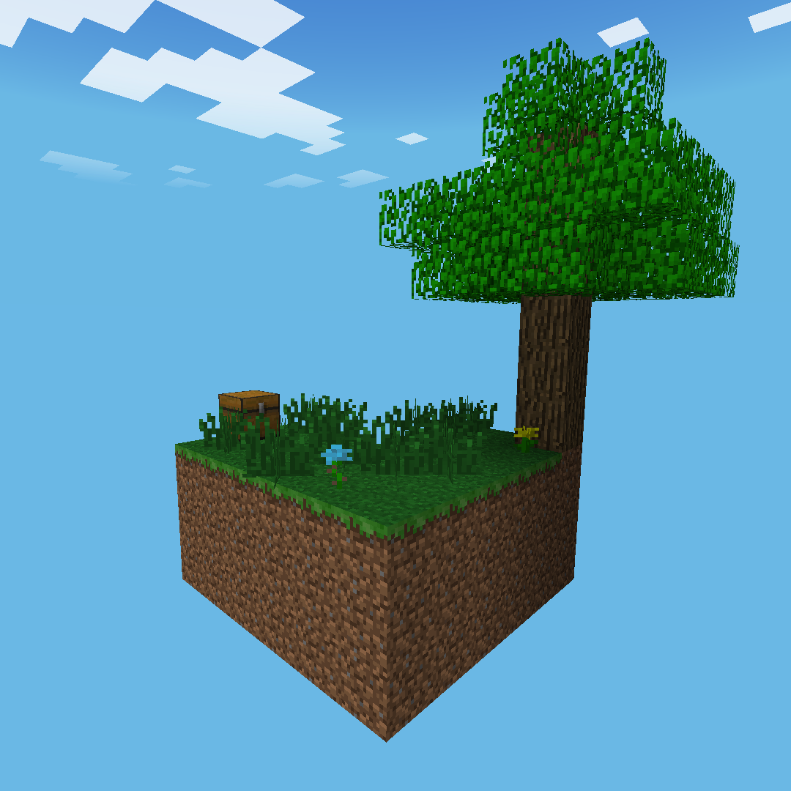

# MCPI-Skyblock
A ported Skyblock for Minecraft: Pi edition

## Before playing
This world is meant for [MCPI-Reborn](https://github.com/MCPI-Revival/minecraft-pi-reborn) **ONLY.**

The reason for this is because the starter chest contains a bucket of lava which is not in normal MCPI or MCPE 0.6.1.

Because of this, make sure you are using MCPI-Reborn 2.4.0 or later.

Also I'd recommend setting your render distance to normal or far as the sand island has been moved to 64 blocks away from spawn.

## How to install
Extract Skyblock.zip to `~/.miencraft-pi/games/com.mojang/minecraftWorlds`

## Credits
Skyblock: [Noobcrew](https://skyblock.net/members/noobcrew.1)

Ported by: [Wallee](https://github.com/Red-exe-Engineer)

Thanks to [Bigjango13](https://github.com/Bigjango13) for their [MCPI-Addons mod](https://github.com/Bigjango13/MCPI-Addons), the sand island wouldn't be possible without it :D
